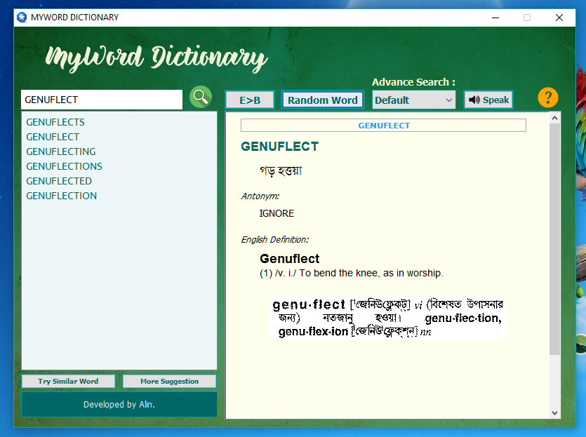

# My Word Dictionary - Java Project

A java dictionary for windows.

## Features :

<ul>
    <li>E2B, B2E and E2E.</li>
    <li>Offline dictionary.</li>
    <li>More than 93000 words for English to Bangla and Bangla to English and E2E 'Gutenberg' with 176023 words. And also more than 21000 words images.</li>
    <li>Display suggestion word for English and Bangla.</li>
    <li>Find word from word list box.</li>
    <li>Display English antonym word.</li>
    <li>Display English definition only for English word.</li>
    <li>Get Random Word meaning.</li>
    <li>Try Similar Word (When user want the meaning/definition of a word but he/she doesn’t the correct spelling of the word then this function will help.)</li>
    <li>Advance search function : wildcard searching for both English and Bangla. such as search words which start with ‘aba’ or, which end with ‘able’ or, start with ‘আনা’ or, end with ‘করা’.</li>
    <li>Add Text to Speech function only for English.</li>
    <li>Add ‘More Suggestion’ function.</li>
    <li>Add ‘Word Image’ function. Get word meaning as an image from ‘Bangla Academy Dictionary’. This is also more accurate like ‘Gutenberg Dictionary’. Which I have used for English definition. But this image data file’s size are 70.8 MB. If you don’t want use this function, just go to the ‘data’ folder and then remove ‘dataAsImage’ folder.</li>
</ul>

### Tips:

It works without 'Word Image' folder 'db/dataAsImage' which size is 70.8 MB. But you can't see the result as image. So, you can remove that folder.  
You can see the installation guide from 'screenshots' folder.  

## Pre-requirement:

<ul>
    <li>Java JDK8, JRE8</li>
     <li>(May be required) JRE1.8 32bit if you want to install this software in Windows 10 (Download from
'https://drive.google.com/open?id=0BwasIjIvyEvZRURaaEU4TTJia0E'). If there is a problem to install, then the exe file should be placed on the Desktop of the C: drive and installed.</li>
</ul>

### Used Fonts:

Tahoma, Solaimanlipi, Wild Creatures Sample, SansSerif.

### Problem:

(The database used is collected from the Internet.)

1. It seems that the meaning of several words is not given correctly.
2. The same thing is coming up many times.

### Project Version:

1.0.0.1 (17-May-2017)

### Start Date:

03-May-2017

### Target Device and Operating System:

Windows 10 (x86 Bit) supported device.

### Developed by:

Md. Rezwan Saki Alin
https://www.alinsworld.com/

### Used Languages and Tools:

Java JDK8, JRE8, NetBeans8.2 (Using Swing)
